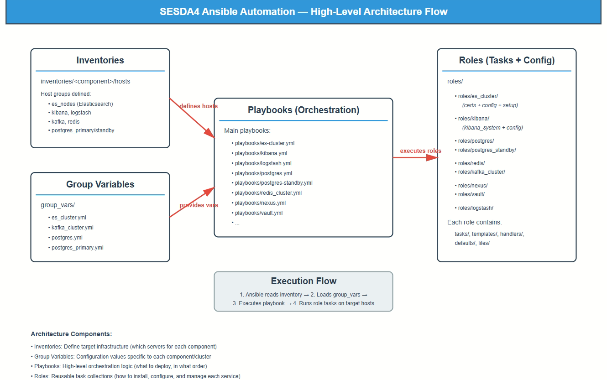
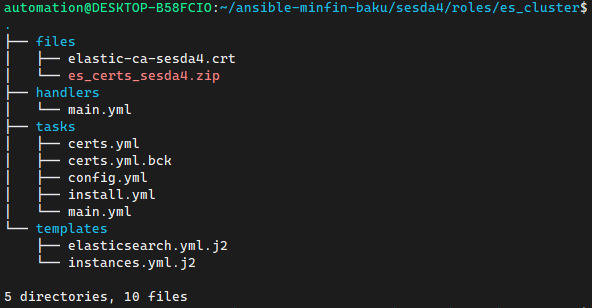
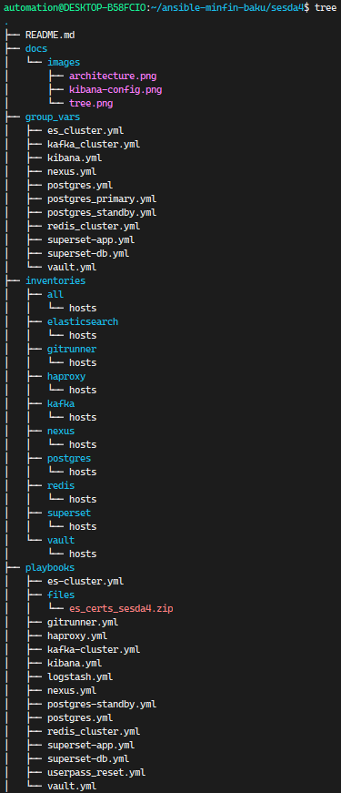
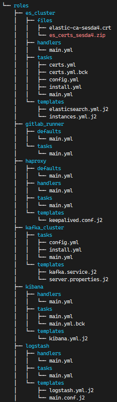
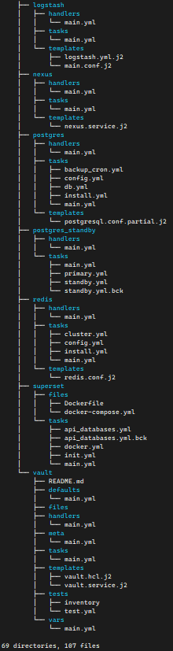

# sesda4 — Ansible automation (from scratch)

This repository automates installation and configuration of multiple services used in **sesda4** environments on **Ubuntu 24.x**, using Ansible inventories per component and reusable roles.

## Repository layout

**Root path (per your tree):**
`/home/automation/ansible-minfin-baku/sesda4/`

- `group_vars/` — component variables (cluster names, ports, paths, credentials)
- `inventories/<component>/hosts` — separate inventories per component
- `playbooks/` — orchestration entry points per component
- `roles/` — implementation (install, config, service)




---

## Prerequisites

- Ansible on control node (your `automation` user)
- SSH connectivity to all hosts (key-based recommended)
- `become` access (sudo) on managed hosts
- Ubuntu 24.x target nodes

---

## How to run playbooks

Each component has its own inventory and playbook.

Example:
```bash
cd ~/ansible-minfin-baku/sesda4
ansible-playbook -i inventories/elasticsearch/hosts playbooks/es-cluster.yml
```

Useful flags:
```bash

# verbose output
ansible-playbook -i inventories/elasticsearch/hosts playbooks/es-cluster.yml -v
```

---

# Components

## Elasticsearch cluster (`roles/es_cluster`)

### What it does
- Installs Elasticsearch
- Generates certs on the **cert master** node and distributes them
- Renders `elasticsearch.yml` from `roles/es_cluster/templates/elasticsearch.yml.j2`
- Manages systemd service

### Certs: recommended handling
1. Pick one node as `es_cert_master`
2. Generate CA + per-node certs on that node
3. Copy required certs to each node using Ansible
4. Set ownership and permissions correctly (avoid `777`)

### Common issue: `AccessDeniedException` on cert files
If Elasticsearch starts only after `chmod -R 777`, permissions are wrong.
Fix by ensuring cert files are readable by the `elasticsearch` user:
- directories: `0750`, owner/group `elasticsearch`
- files: `0640`, owner/group `elasticsearch`




Run:
```bash
ansible-playbook -i inventories/elasticsearch/hosts playbooks/es-cluster.yml
```

---

## Kibana (`roles/kibana`) — installed on first ES node

### Key points
- Kibana **must NOT** use the `elastic` superuser in config.
- Use `kibana_system` user.

Run:
```bash
ansible-playbook -i inventories/elasticsearch/hosts playbooks/kibana.yml
```

---

## Logstash (`roles/logstash`) — installed on first ES node

- Installs Logstash
- Deploys `logstash.yml` and pipeline config (`main.conf`)
- Points output to Elasticsearch hosts

Run:
```bash
ansible-playbook -i inventories/elasticsearch/hosts playbooks/logstash.yml
```

---

## Kafka KRaft cluster (`roles/kafka_cluster`)

### Your custom changes (from conversation)
- Kafka base/config moved to: **`/etc/kafka`**
- Logs directory: **`/var/log/kafka`**
- Prefer `become: yes` (avoid `become_user: kafka`); set ownership/mode explicitly

Run:
```bash
ansible-playbook -i inventories/kafka/hosts playbooks/kafka-cluster.yml
```

---

## Redis Cluster (`roles/redis`)

### Common issue: “connection refused” while service is running
If Redis listens only on `127.0.0.1:6379`, remote connections fail.
Ensure your redis config (template) sets:
- `bind 0.0.0.0`
- cluster ports are open between nodes

Run:
```bash
ansible-playbook -i inventories/redis/hosts playbooks/redis_cluster.yml
```

---

## PostgreSQL primary (`roles/postgres`)

### Install / config
- PG 17 install
- Data directory: `/pgsql/data`
- Archive directory: `/pgarch/archive` (primary only)

Run:
```bash
ansible-playbook -i inventories/postgres/hosts playbooks/postgres.yml
```

### Backup script + cron (as postgres user)

Requirement:
- Copy your backup script to: `/pgbackup/backup.sh`
- Add cron (postgres user):
  - `00 00 * * 6 /pgbackup/backup.sh`
  - `05 00 * * * /usr/bin/find /pgarch/archive -type f -mtime +30 -delete > /dev/null 2>&1`

Implementation notes:
- Ensure `roles/postgres/files/backup.sh` exists (script content)
- Ensure `roles/postgres/tasks/backup_cron.yml`:
  - creates `/pgbackup` (and archive dirs if needed)
  - copies script to `/pgbackup/backup.sh`
  - installs cron entries with `cron:` module (user: postgres)

---

## PostgreSQL standby (`roles/postgres_standby`)

### Flow
- Primary-side: create replication user and add `pg_hba.conf` entry for standby IP (/32)
- Standby-side:
  - install PG 17
  - stop service
  - wipe `/pgsql/data`
  - run `pg_basebackup -R` from primary
  - start service

### Common issue: `no pg_hba.conf entry for replication connection`
Fix on primary by adding:
```conf
host  replication  replica  <standby_ip>/32  scram-sha-256
```
and reload PostgreSQL.

Run:
```bash
ansible-playbook -i inventories/postgres/hosts playbooks/postgres-standby.yml
```

---

## Nexus (`roles/nexus`)
Run:
```bash
ansible-playbook -i inventories/nexus/hosts playbooks/nexus.yml
```

---

## Vault (`roles/vault`)
Run:
```bash
ansible-playbook -i inventories/vault/hosts playbooks/vault.yml
```

---

## HAProxy / Keepalived (`roles/haproxy`)
Run:
```bash
ansible-playbook -i inventories/haproxy/hosts playbooks/haproxy.yml
```

---

## GitLab Runner (`roles/gitlab_runner`)
Run:
```bash
ansible-playbook -i inventories/gitrunner/hosts playbooks/gitrunner.yml
```

---

## Superset (`roles/superset`)

Two playbooks:
- `playbooks/superset-db.yml`
- `playbooks/superset-app.yml`

Run:
```bash
ansible-playbook -i inventories/superset/hosts playbooks/superset-db.yml
ansible-playbook -i inventories/superset/hosts playbooks/superset-app.yml
```

---

# Troubleshooting quick hits

- **Role not found**: playbook `roles:` must match folder name under `roles/`
- **Undefined vars**: ensure `group_vars/<component>.yml` exists and is loaded by the playbook
- **Permission errors**: fix owner/mode instead of using `777`
- **Postgres standby basebackup fails**: add correct `pg_hba.conf` replication entry on primary

---

## Screenshots




